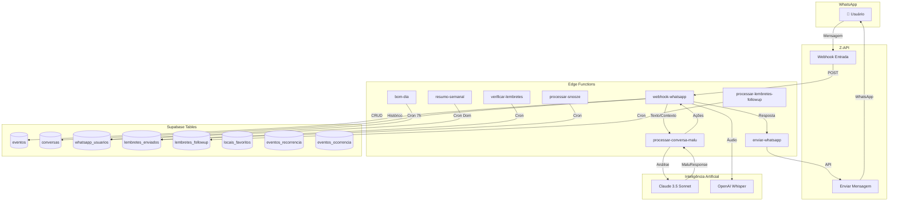
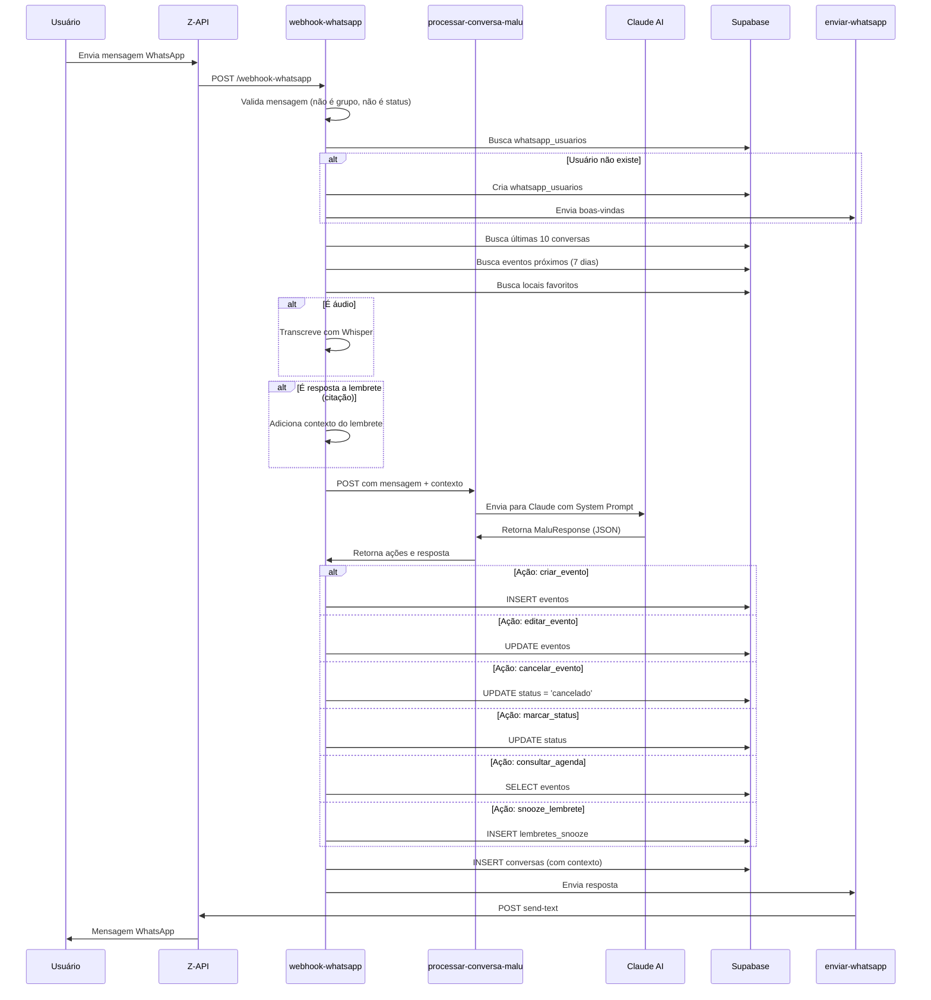
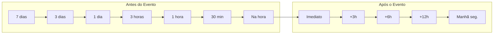

# 📚 Documentação do Sistema Malu

> Assistente pessoal via WhatsApp para gerenciamento de agenda e lembretes

---

## 📋 Índice

1. [Arquitetura Geral](#arquitetura-geral)
2. [Estrutura das Tabelas](#estrutura-das-tabelas)
3. [Fluxo Principal de Conversa](#fluxo-principal-de-conversa)
4. [System Prompt do Claude](#system-prompt-do-claude)
5. [Estrutura do Contexto](#estrutura-do-contexto)
6. [Estrutura MaluResponse](#estrutura-maluresponse)
7. [Sistema de Lembretes](#sistema-de-lembretes)
8. [Handlers Especiais](#handlers-especiais)
9. [Edge Functions](#edge-functions)
10. [Pontos Críticos de Debug](#pontos-críticos-de-debug)

---

## 🏗️ Arquitetura Geral



---

## 🗄️ Estrutura das Tabelas

### eventos
Tabela principal que armazena todos os compromissos e lembretes.

| Coluna | Tipo | Descrição |
|--------|------|-----------|
| `id` | uuid | Identificador único |
| `usuario_id` | uuid | Referência ao usuário (auth.users) |
| `titulo` | text | Título do evento |
| `tipo` | text | `compromisso`, `lembrete`, `tarefa`, `pagamento` |
| `data` | timestamptz | Data e hora do evento |
| `descricao` | text | Descrição opcional |
| `endereco` | text | Endereço do local |
| `pessoa` | text | Pessoa relacionada ao evento |
| `status` | text | `pendente`, `concluido`, `cancelado` |
| `lembretes` | jsonb | Array de minutos antes para lembrar |
| `checklist` | jsonb | Lista de itens a verificar |
| `eh_recorrente` | boolean | Se é evento recorrente |
| `recorrencia_id` | uuid | Referência à recorrência |
| `tempo_viagem_minutos` | integer | Tempo estimado de viagem |
| `origem_viagem` | text | Endereço de origem |
| `ultimo_calculo_viagem` | timestamptz | Última atualização do cálculo |
| `criado_em` | timestamptz | Data de criação |

**Valores padrão de lembretes por tipo:**
```javascript
const lembretesPadrao = {
  compromisso: [180, 60, 30, 0],      // 3h, 1h, 30min, na hora
  lembrete: [1440, 60, 0],            // 1 dia, 1h, na hora
  tarefa: [10080, 4320, 1440, 60],    // 7d, 3d, 1d, 1h
  pagamento: [10080, 4320, 1440, 60, 0] // 7d, 3d, 1d, 1h, na hora
};
```

---

### conversas
Histórico de todas as mensagens trocadas.

| Coluna | Tipo | Descrição |
|--------|------|-----------|
| `id` | uuid | Identificador único |
| `usuario_id` | uuid | Referência ao usuário |
| `whatsapp_de` | text | Número WhatsApp do remetente |
| `mensagem_usuario` | text | Mensagem enviada pelo usuário |
| `mensagem_malu` | text | Resposta da Malu |
| `contexto` | jsonb | Contexto da conversa (ações pendentes, eventos listados) |
| `zapi_message_id` | text | ID da mensagem no Z-API |
| `criada_em` | timestamptz | Data da conversa |

---

### whatsapp_usuarios
Vinculação entre usuários autenticados e números WhatsApp.

| Coluna | Tipo | Descrição |
|--------|------|-----------|
| `id` | uuid | Identificador único |
| `usuario_id` | uuid | Referência ao usuário |
| `whatsapp` | text | Número no formato 5511999999999 |
| `nome` | text | Nome do usuário |
| `ativo` | boolean | Se está ativo |
| `primeiro_evento_criado_em` | timestamptz | Data do primeiro evento |
| `tempo_ate_ativacao_segundos` | integer | Tempo até criar primeiro evento |
| `criado_em` | timestamptz | Data de cadastro |

---

### lembretes_enviados
Registro de todos os lembretes enviados.

| Coluna | Tipo | Descrição |
|--------|------|-----------|
| `id` | uuid | Identificador único |
| `evento_id` | uuid | Referência ao evento |
| `usuario_id` | uuid | Referência ao usuário |
| `tipo_lembrete` | text | Ex: `180min`, `60min`, `30min`, `0min` |
| `status` | text | `enviado`, `lido`, `respondido` |
| `zapi_message_id` | text | ID da mensagem no Z-API |
| `enviado_em` | timestamptz | Data de envio |
| `lido_em` | timestamptz | Data de leitura |

---

### lembretes_followup
Sistema de acompanhamento pós-evento.

| Coluna | Tipo | Descrição |
|--------|------|-----------|
| `id` | uuid | Identificador único |
| `usuario_id` | uuid | Referência ao usuário |
| `evento_id` | uuid | Referência ao evento |
| `whatsapp` | text | Número WhatsApp |
| `tentativas` | integer | Número de tentativas (0-10) |
| `intervalo_atual` | integer | Intervalo em minutos (180, 360, 720...) |
| `max_tentativas` | integer | Máximo de tentativas (padrão: 10) |
| `max_dias` | integer | Máximo de dias (padrão: 7) |
| `ultima_pergunta` | timestamptz | Data da última pergunta |
| `proxima_pergunta` | timestamptz | Data da próxima pergunta |
| `data_limite` | timestamptz | Data limite para perguntar |
| `ativo` | boolean | Se está ativo |
| `concluido` | boolean | Se foi concluído |

**Sequência de follow-up:**
```
Evento termina → Imediatamente → 3h → 6h → 12h → Manhã seguinte (7h)
```

---

### locais_favoritos
Endereços salvos pelo usuário.

| Coluna | Tipo | Descrição |
|--------|------|-----------|
| `id` | uuid | Identificador único |
| `usuario_id` | uuid | Referência ao usuário |
| `apelido` | text | Nome curto (ex: "casa", "trabalho") |
| `endereco` | text | Endereço completo |
| `criado_em` | timestamptz | Data de criação |
| `atualizado_em` | timestamptz | Data de atualização |

---

### eventos_recorrencia
Configuração de eventos recorrentes.

| Coluna | Tipo | Descrição |
|--------|------|-----------|
| `id` | uuid | Identificador único |
| `evento_original_id` | uuid | Evento modelo |
| `usuario_id` | uuid | Referência ao usuário |
| `frequencia` | text | `diaria`, `semanal`, `mensal` |
| `intervalo` | integer | A cada X períodos |
| `dias_semana` | integer[] | Array de dias (0=dom, 6=sab) |
| `dia_mes` | integer | Dia do mês (1-31) |
| `data_inicio` | date | Data de início |
| `data_fim` | date | Data de término (opcional) |
| `numero_ocorrencias` | integer | Número máximo de ocorrências |
| `ativo` | boolean | Se está ativo |

---

### eventos_ocorrencia
Controle de ocorrências individuais de eventos recorrentes.

| Coluna | Tipo | Descrição |
|--------|------|-----------|
| `id` | uuid | Identificador único |
| `recorrencia_id` | uuid | Referência à recorrência |
| `evento_id` | uuid | Referência ao evento gerado |
| `data_ocorrencia` | date | Data da ocorrência |
| `excluido` | boolean | Se foi excluído individualmente |
| `criado_em` | timestamptz | Data de criação |

---

## 🔄 Fluxo Principal de Conversa



---

## 🤖 System Prompt do Claude

### Persona e Estilo
```
Você é Malu, assistente pessoal brasileira que ajuda a gerenciar agenda via WhatsApp.

ESTILO:
- Comunicação natural e amigável, como uma amiga próxima
- Respostas curtas e diretas (máximo 3 linhas quando possível)
- Usa emojis com moderação para dar personalidade
- Confirma ações de forma clara mas concisa
```

### Prioridades de Interpretação
```
PRIORIDADE 1: Se o usuário respondeu citando uma mensagem anterior
→ Analise a mensagem citada para entender o contexto
→ A resposta geralmente é sobre o evento mencionado na citação

PRIORIDADE 2: Se há ação pendente no contexto
→ Verifique acao_pendente no contexto
→ Complete a ação com as informações fornecidas

PRIORIDADE 3: Interprete a mensagem naturalmente
→ Identifique a intenção do usuário
→ Execute a ação apropriada
```

### Ações Disponíveis
```typescript
AÇÕES PERMITIDAS:
- criar_evento: Criar novo compromisso/lembrete/tarefa/pagamento
- editar_evento: Alterar data, hora, título de evento existente
- cancelar_evento: Cancelar evento (status = 'cancelado')
- marcar_status: Marcar como concluído ou pendente
- consultar_agenda: Listar eventos por período/filtro
- snooze_lembrete: Adiar lembrete por X minutos
- criar_recorrente: Criar evento que se repete
- salvar_local: Salvar endereço favorito
- conversar: Apenas responder sem ação no banco

NUNCA FAÇA:
- Não invente eventos que não existem
- Não assuma informações não fornecidas
- Não execute ações sem confirmação quando ambíguo
```

### Formato de Data/Hora
```
SEMPRE USE:
- Data: YYYY-MM-DD (ex: 2025-01-15)
- Hora: HH:MM (ex: 14:30)

INTERPRETAÇÃO:
- "amanhã às 3" → próximo dia, 15:00 (tarde por padrão)
- "19h" → 19:00
- "7 da noite" → 19:00
- "meio-dia" → 12:00
- "segunda" → próxima segunda-feira
```

---

## 📦 Estrutura do Contexto

O contexto é salvo em `conversas.contexto` como JSONb:

### Mensagem Normal
```json
{
  "data_hora_atual": "2025-01-15T10:30:00-03:00",
  "eventos_proximos": [
    {
      "id": "uuid",
      "titulo": "Dentista",
      "tipo": "compromisso",
      "data": "2025-01-15T14:00:00-03:00",
      "status": "pendente"
    }
  ],
  "locais_favoritos": [
    { "apelido": "casa", "endereco": "Rua X, 123" }
  ]
}
```

### Ação Pendente (Edição)
```json
{
  "acao_pendente": "editar_evento",
  "evento_id": "uuid-do-evento",
  "evento_titulo": "Reunião com João",
  "aguardando": "nova_data ou nova_hora"
}
```

### Ação Pendente (Seleção de Lista)
```json
{
  "acao_pendente": "selecionar_para_editar",
  "eventos_listados": [
    { "id": "uuid-1", "titulo": "Evento 1", "numero": 1 },
    { "id": "uuid-2", "titulo": "Evento 2", "numero": 2 }
  ]
}
```

### Mensagem Citada (Reply)
```json
{
  "mensagem_citada": {
    "id": "zapi-message-id",
    "texto": "⏰ Lembrete: Dentista às 14h",
    "evento_id": "uuid-do-evento",
    "tipo_lembrete": "60min"
  }
}
```

---

## 📤 Estrutura MaluResponse

Interface TypeScript do retorno do Claude:

```typescript
interface MaluResponse {
  // Resposta para o usuário
  resposta: string;
  
  // Ação principal
  acao: 
    | 'criar_evento'
    | 'editar_evento'
    | 'cancelar_evento'
    | 'marcar_status'
    | 'consultar_agenda'
    | 'snooze_lembrete'
    | 'criar_recorrente'
    | 'salvar_local'
    | 'conversar';
  
  // Para criar_evento
  tipo?: 'compromisso' | 'lembrete' | 'tarefa' | 'pagamento';
  titulo?: string;
  data?: string;      // YYYY-MM-DD
  hora?: string;      // HH:MM
  descricao?: string;
  endereco?: string;
  pessoa?: string;
  
  // Para editar_evento
  evento_id?: string;
  nova_data?: string;
  nova_hora?: string;
  novo_titulo?: string;
  
  // Para consultar_agenda
  busca?: string;
  periodo?: 'hoje' | 'amanha' | 'semana' | 'mes';
  filtro_status?: 'pendente' | 'concluido' | 'todos';
  
  // Para marcar_status
  novo_status?: 'concluido' | 'pendente';
  
  // Para snooze_lembrete
  minutos?: number;
  
  // Para criar_recorrente
  recorrencia?: {
    frequencia: 'diaria' | 'semanal' | 'mensal';
    intervalo?: number;
    dias_semana?: number[];
    dia_mes?: number;
    data_fim?: string;
  };
  
  // Para salvar_local
  apelido?: string;
  
  // Contexto para próxima mensagem
  contexto_proximo?: {
    acao_pendente?: string;
    evento_id?: string;
    aguardando?: string;
  };
}
```

---

## ⏰ Sistema de Lembretes

### Escalonamento de Lembretes



### Lógica Anti-Spam Inteligente

```typescript
// Lembretes críticos (sempre enviam)
const LEMBRETES_CRITICOS = [60, 30, 0]; // 1h, 30min, na hora

// Para lembretes não-críticos, verifica última comunicação
if (!LEMBRETES_CRITICOS.includes(minutos)) {
  const ultimaComunicacao = await getUltimaComunicacao(usuario_id);
  const diferencaMinutos = (agora - ultimaComunicacao) / 60000;
  
  // Pula se houve comunicação recente
  if (diferencaMinutos < 30) {
    console.log('Pulando lembrete - comunicação recente');
    return;
  }
}
```

### Mensagens de Lembrete por Tempo

```typescript
const mensagensLembrete = {
  10080: "📅 Daqui a 1 semana: {titulo}",
  4320:  "📅 Daqui a 3 dias: {titulo}",
  1440:  "📅 Amanhã: {titulo}",
  180:   "⏰ Em 3 horas: {titulo}",
  60:    "⏰ Em 1 hora: {titulo}",
  30:    "⏰ Em 30 minutos: {titulo}",
  0:     "🔔 AGORA: {titulo}"
};
```

### Follow-up Pós-Evento

```typescript
// Perguntas de follow-up
const perguntasFollowup = [
  "E aí, como foi {titulo}? 😊",
  "Conseguiu resolver {titulo}?",
  "Tudo certo com {titulo}?",
  "{titulo} - deu tudo certo?"
];

// Intervalos progressivos
const intervalosFollowup = [
  0,      // Imediatamente após evento
  180,    // 3 horas
  360,    // 6 horas
  720,    // 12 horas
  // Depois: manhã seguinte às 7h
];
```

---

## 🔧 Handlers Especiais

### Handler de Primeira Mensagem
```typescript
// Detecta primeiro contato
if (!whatsappUser) {
  await criarUsuarioWhatsApp(whatsapp, nome);
  await enviarBoasVindas(whatsapp);
  return;
}
```

### Handler de Resposta Numérica
```typescript
// Usuário respondeu "2" para selecionar da lista
if (/^\d+$/.test(mensagem) && contexto.eventos_listados) {
  const escolha = parseInt(mensagem);
  const eventoEscolhido = contexto.eventos_listados
    .find(e => e.numero === escolha);
  
  if (eventoEscolhido) {
    // Executa ação pendente com evento escolhido
    await executarAcaoPendente(contexto.acao_pendente, eventoEscolhido);
  }
}
```

### Handler de Citação (Reply)
```typescript
// Usuário respondeu citando mensagem de lembrete
if (quotedMessage) {
  const lembreteOriginal = await buscarLembretePorMessageId(
    quotedMessage.messageId
  );
  
  if (lembreteOriginal) {
    contexto.mensagem_citada = {
      evento_id: lembreteOriginal.evento_id,
      tipo_lembrete: lembreteOriginal.tipo_lembrete,
      texto: quotedMessage.text
    };
  }
}
```

### Handler de Imagem
```typescript
// Processa imagem com Claude Vision
if (message.image) {
  const imageBase64 = await downloadImage(message.image.imageUrl);
  
  const response = await claude.messages.create({
    model: "claude-3-5-sonnet-20241022",
    messages: [{
      role: "user",
      content: [
        { type: "image", source: { type: "base64", data: imageBase64 }},
        { type: "text", text: "Analise esta imagem..." }
      ]
    }]
  });
}
```

### Handler de Áudio
```typescript
// Transcreve áudio com Whisper
if (message.audio) {
  const audioBuffer = await downloadAudio(message.audio.audioUrl);
  
  const transcription = await openai.audio.transcriptions.create({
    file: audioBuffer,
    model: "whisper-1",
    language: "pt"
  });
  
  mensagemTexto = transcription.text;
}
```

---

## 🚀 Edge Functions

| Função | Trigger | Descrição |
|--------|---------|-----------|
| `webhook-whatsapp` | Webhook Z-API | Recebe e processa mensagens do WhatsApp |
| `processar-conversa-malu` | Chamada interna | Envia para Claude e retorna MaluResponse |
| `processar-comando` | Chamada interna | Processa comandos específicos (legacy) |
| `enviar-whatsapp` | Chamada interna | Envia mensagens via Z-API |
| `verificar-lembretes` | Cron (1 min) | Verifica e envia lembretes pendentes |
| `processar-lembretes-followup` | Cron (5 min) | Processa follow-ups pós-evento |
| `processar-snooze` | Cron (1 min) | Envia lembretes adiados |
| `bom-dia` | Cron (7h) | Envia resumo matinal |
| `resumo-semanal` | Cron (Dom 9h) | Envia resumo da semana |
| `calcular-tempo-viagem` | Chamada interna | Calcula rota via Google Maps |
| `enviar-boas-vindas` | Chamada interna | Envia mensagem de boas-vindas |

---

## 🐛 Pontos Críticos de Debug

### 1. Contexto não recuperado corretamente

```typescript
// ✅ Correto: buscar todas as ações pendentes
const { data: conversas } = await supabase
  .from('conversas')
  .select('contexto')
  .eq('whatsapp_de', whatsapp)
  .order('criada_em', { ascending: false })
  .limit(10);

// Procurar em todas as conversas recentes
for (const conv of conversas) {
  if (conv.contexto?.acao_pendente) {
    contextoAtivo = conv.contexto;
    break;
  }
}
```

### 2. Ação pendente ignorada

```typescript
// Log para debug
console.log('🔍 Contexto encontrado:', JSON.stringify({
  acao_pendente: contexto.acao_pendente,
  evento_id: contexto.evento_id,
  eventos_listados: contexto.eventos_listados?.length
}));
```

### 3. Hora extraída incorretamente

```typescript
// Pós-processamento de correção de hora
const horaExtraida = resultado.nova_hora || resultado.hora;
if (horaExtraida) {
  // Verifica se a hora faz sentido com a mensagem
  const horaMatch = mensagem.match(/(\d{1,2})(?::(\d{2}))?(?:\s*h)?/i);
  if (horaMatch) {
    const horaUsuario = parseInt(horaMatch[1]);
    const horaResultado = parseInt(horaExtraida.split(':')[0]);
    
    if (Math.abs(horaUsuario - horaResultado) > 3) {
      console.log('⚠️ Corrigindo hora:', horaExtraida, '->', `${horaUsuario}:00`);
      resultado.nova_hora = `${horaUsuario.toString().padStart(2, '0')}:00`;
    }
  }
}
```

### 4. Número não processado

```typescript
// Debug de seleção numérica
console.log('🔢 Processando número:', {
  mensagem,
  escolhaNum: parseInt(mensagem),
  totalEventos: contexto.eventos_listados?.length,
  eventosDisponiveis: contexto.eventos_listados?.map(e => ({
    numero: e.numero,
    titulo: e.titulo
  }))
});
```

### 5. Lembrete não enviado

```typescript
// Verificar condições de envio
console.log('📬 Verificando lembrete:', {
  evento_id,
  minutos_antes: minutos,
  ja_enviado: lembreteExistente !== null,
  ultima_comunicacao_minutos: diferencaMinutos,
  vai_enviar: !lembreteExistente && (CRITICO || diferencaMinutos > 30)
});
```

---

## 📝 Logs Importantes

### Webhook WhatsApp
```
📥 Mensagem recebida: {whatsapp} - {texto}
🔍 Contexto ativo: {acao_pendente}
🤖 Resposta Claude: {acao} - {resposta}
📤 Enviando resposta: {texto}
```

### Processar Conversa
```
🧠 Processando: {mensagem}
📋 Contexto: {eventos_proximos.length} eventos, {locais.length} locais
✅ Ação identificada: {acao}
```

### Verificar Lembretes
```
⏰ Verificando lembretes: {data_hora}
📬 Lembretes a enviar: {count}
✅ Lembrete enviado: {evento_titulo} - {tipo_lembrete}
⏭️ Pulando (comunicação recente): {evento_titulo}
```

---

## 🔐 Segurança

### RLS Policies Principais

```sql
-- Eventos: usuário só vê/edita próprios eventos
CREATE POLICY "Usuários podem ver seus próprios eventos"
ON eventos FOR SELECT
USING (auth.uid() = usuario_id);

-- Conversas: sistema pode inserir, usuário pode ler próprias
CREATE POLICY "Sistema pode inserir conversas"
ON conversas FOR INSERT
WITH CHECK (true);

CREATE POLICY "Usuários podem ver suas próprias conversas"
ON conversas FOR SELECT
USING (auth.uid() = usuario_id);
```

### Validação de Webhook

```typescript
// Validar origem Z-API
const clientToken = req.headers.get('x-client-token');
const expectedToken = Deno.env.get('ZAPI_CLIENT_TOKEN');

if (clientToken !== expectedToken) {
  console.error('❌ Token inválido');
  return new Response('Unauthorized', { status: 401 });
}
```

---

## 📊 Métricas e Analytics

### Campos de Tracking

```sql
-- whatsapp_usuarios
primeiro_evento_criado_em    -- Quando criou primeiro evento
tempo_ate_ativacao_segundos  -- Tempo do cadastro até primeiro evento

-- usuario_stats
total_concluidos  -- Total de eventos concluídos
dias_seguidos     -- Streak atual
melhor_sequencia  -- Melhor streak histórico
```

---

*Documentação atualizada em: Dezembro 2024*
*Versão: 1.0*
